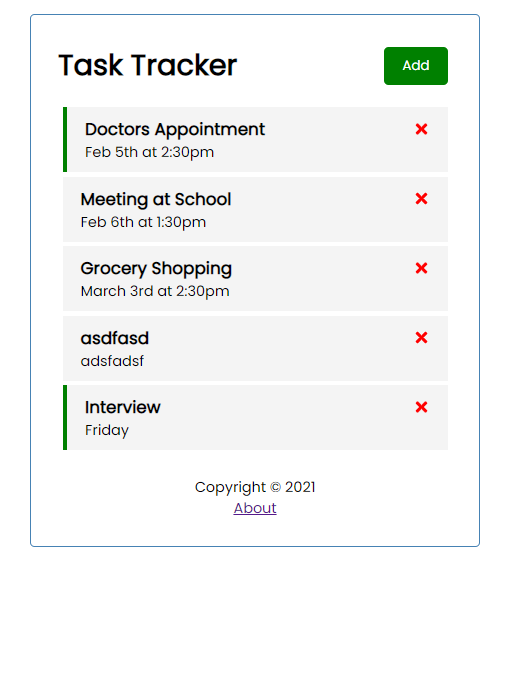

<h1>Task Tracker App</h1>

Built to reiterate basic fundamentals of react with components, props, state, hooks, and working with a API

Here are some of the different features built for this Task Tracker

<ul>
  <li>Component Props</li>
  <li>Creating a list with .map()</li>
  <li>State & useState Hook</li>
  <li>Global State</li>
  <li>Icons with react-icons</li>
  <li>JSON Server</li>
  <li>useEffect Hook & Fetch tasks from server</li>
  <li>Routing, footer & about</li>
</ul>
